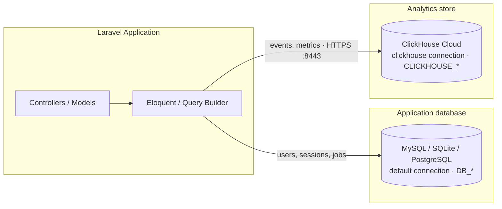

# ClickHouse Analytics for Laravel

Laravel application that uses **ClickHouse** as a dedicated analytics store alongside a traditional OLTP database (MySQL, SQLite, etc.). Application data stays on your default connection; event and analytics workloads go through a separate `clickhouse` connection over HTTPS.


## Table of contents

- [Features](#features)
- [Architecture](#architecture)
- [Requirements](#requirements)
- [Installation](#installation)
- [Configuration](#configuration)
- [Verify the connection](#verify-the-connection)
- [Migrations](#migrations)
- [Usage](#usage)
- [Partitions](#partitions)
- [Inspect data in ClickHouse Cloud](#inspect-data-in-clickhouse-cloud)
- [Documentation](#documentation)

## Features

- ClickHouse Cloud (HTTPS) and self-hosted ClickHouse support
- Dedicated `clickhouse` database connection (keeps app DB separate)
- Eloquent models via `ClickHouse\Laravel\Eloquent\Model`
- Schema builder with `MergeTree`, `ORDER BY`, and `PARTITION BY`
- Sample `events` table, model, and migration ready to run
- Parallel-ready HTTP transport (Guzzle)

## Architecture



| Store | Connection | Use for |
|-------|------------|---------|
| MySQL / SQLite / PostgreSQL | `default` (`DB_*`) | Users, sessions, jobs, app state |
| ClickHouse | `clickhouse` (`CLICKHOUSE_*`) | Events, metrics, analytics |

## Requirements

| Dependency | Version |
|------------|---------|
| PHP | 8.3+ |
| Laravel | 13 |
| Composer | 2.x |
| ClickHouse | Self-hosted or [ClickHouse Cloud](https://clickhouse.cloud/) |
| Package | [`laravel-clickhouse/laravel-clickhouse`](https://github.com/laravel-clickhouse/laravel-clickhouse) ^1.4 |

## Installation

```bash
git clone <repository-url>
cd clickhouse

composer install
cp .env.example .env
php artisan key:generate
```

Optional frontend assets:

```bash
npm install && npm run build
```

The ClickHouse driver is already listed in `composer.json`. To add it to another project:

```bash
composer require laravel-clickhouse/laravel-clickhouse
```

The package auto-discovers — no service provider registration required.

## Configuration

### Environment variables

Copy values from your ClickHouse Cloud **HTTPS** connection dialog (not the MySQL protocol tab).

```env
# Application database
DB_CONNECTION=mysql
DB_HOST=127.0.0.1
DB_PORT=3306
DB_DATABASE=click_house
DB_USERNAME=root
DB_PASSWORD=

# ClickHouse (HTTPS interface)
CLICKHOUSE_HOST=your-service.region.provider.clickhouse.cloud
CLICKHOUSE_PORT=8443
CLICKHOUSE_DATABASE=default
CLICKHOUSE_USERNAME=default
CLICKHOUSE_PASSWORD=your-password
CLICKHOUSE_HTTPS=true
CLICKHOUSE_TRANSPORT=guzzle
CLICKHOUSE_TIMEOUT=30
CLICKHOUSE_CONNECT_TIMEOUT=10
CLICKHOUSE_USE_LIGHTWEIGHT_DELETE=false
```

| Variable | Description |
|----------|-------------|
| `CLICKHOUSE_HOST` | Hostname from the Cloud **HTTPS** dialog |
| `CLICKHOUSE_PORT` | `8443` (Cloud HTTPS) or `8123` (local HTTP) |
| `CLICKHOUSE_DATABASE` | Database name (usually `default`) |
| `CLICKHOUSE_USERNAME` | Native user (usually `default`) |
| `CLICKHOUSE_PASSWORD` | Service password (shown only at creation — reset if lost) |
| `CLICKHOUSE_HTTPS` | `true` for TLS / Cloud |
| `CLICKHOUSE_TRANSPORT` | `guzzle` (default) or `curl` |
| `CLICKHOUSE_TIMEOUT` | Request timeout in seconds |
| `CLICKHOUSE_CONNECT_TIMEOUT` | TCP connect timeout in seconds |

### Local vs Cloud

| Setting | Local ClickHouse | ClickHouse Cloud |
|---------|------------------|------------------|
| Host | `127.0.0.1` | `*.clickhouse.cloud` |
| Port | `8123` | `8443` |
| HTTPS | `false` | `true` |
| Username | `default` | `default` |

### Database connection

Defined in `config/database.php`:

```php
'clickhouse' => [
    'driver' => 'clickhouse',
    'host' => env('CLICKHOUSE_HOST', '127.0.0.1'),
    'port' => env('CLICKHOUSE_PORT', 8123),
    'database' => env('CLICKHOUSE_DATABASE', 'default'),
    'username' => env('CLICKHOUSE_USERNAME', 'default'),
    'password' => env('CLICKHOUSE_PASSWORD', ''),
    'https' => filter_var(env('CLICKHOUSE_HTTPS', false), FILTER_VALIDATE_BOOLEAN),
    'transport' => env('CLICKHOUSE_TRANSPORT', 'guzzle'),
    'timeout' => env('CLICKHOUSE_TIMEOUT'),
    'connect_timeout' => env('CLICKHOUSE_CONNECT_TIMEOUT'),
    'engine' => env('CLICKHOUSE_ENGINE'),
    'use_lightweight_delete' => filter_var(
        env('CLICKHOUSE_USE_LIGHTWEIGHT_DELETE', false),
        FILTER_VALIDATE_BOOLEAN
    ),
],
```

## Verify the connection

```bash
php artisan tinker --execute 'DB::connection("clickhouse")->select("SELECT 1");'
```

Successful response:

```php
[['1' => 1]]
```

## Migrations

ClickHouse migrations set `protected $connection = 'clickhouse'` and use the ClickHouse blueprint.

### Run the sample migration

```bash
php artisan migrate --database=clickhouse \
  --path=database/migrations/2026_09_24_072944_create_events_table.php
```

### Example

```php
use ClickHouse\Laravel\Schema\Blueprint as ClickHouseBlueprint;
use Illuminate\Database\Migrations\Migration;
use Illuminate\Support\Facades\Schema;

return new class extends Migration
{
    protected $connection = 'clickhouse';

    public function up(): void
    {
        Schema::connection('clickhouse')->create('events', function (ClickHouseBlueprint $table) {
            $table->unsignedBigInteger('id');
            $table->unsignedInteger('user_id');
            $table->text('type');
            $table->text('name')->nullable();
            $table->dateTime('created_at');

            $table->engine('MergeTree()');
            $table->orderBy(['id']);
            $table->partitionBy('toYYYYMM(created_at)');
        });
    }

    public function down(): void
    {
        Schema::connection('clickhouse')->drop('events');
    }
};
```

| Clause | Purpose |
|--------|---------|
| `engine('MergeTree()')` | Standard analytics table engine |
| `orderBy(['id'])` | Physical sort / primary key on disk |
| `partitionBy('toYYYYMM(created_at)')` | Split data by month for pruning and cheap drops |

## Usage

### Query builder

```php
use Illuminate\Support\Facades\DB;

$events = DB::connection('clickhouse')
    ->table('events')
    ->where('user_id', 1)
    ->orderBy('created_at', 'desc')
    ->limit(10)
    ->get();

DB::connection('clickhouse')->table('events')->insert([
    'id' => 2,
    'user_id' => 1,
    'type' => 'click',
    'name' => 'homepage',
    'created_at' => now()->format('Y-m-d H:i:s'),
]);
```

### Eloquent model

Models must extend `ClickHouse\Laravel\Eloquent\Model` (not Laravel’s default Eloquent base).

```php
namespace App\Models;

use ClickHouse\Laravel\Eloquent\Model;

class Event extends Model
{
    protected $connection = 'clickhouse';

    protected $table = 'events';

    protected $guarded = [];

    /** Table has created_at only — no updated_at column. */
    public const UPDATED_AT = null;
}
```

```php
use App\Models\Event;

Event::create([
    'id' => 6,
    'user_id' => 2,
    'type' => 'click',
    'name' => 'test',
    'created_at' => now()->format('Y-m-d H:i:s'),
]);

$events = Event::where('type', 'click')->get();
$count  = Event::where('user_id', 1)->count();
```

> **Tinker tip:** Bare `Event::` resolves to Laravel’s event facade. Use `\App\Models\Event::` or `use App\Models\Event;`.

> **IDs:** ClickHouse does not support auto-increment keys. Provide `id` yourself (UUID, snowflake, sequence, etc.).

### Controller example

```php
namespace App\Http\Controllers;

use App\Models\Event;
use Illuminate\Http\JsonResponse;

class EventController extends Controller
{
    public function index(): JsonResponse
    {
        return response()->json(
            Event::query()
                ->orderBy('created_at', 'desc')
                ->limit(100)
                ->get()
        );
    }
}
```

## Partitions

The sample `events` table is partitioned by month (`toYYYYMM(created_at)`).

### List partitions and parts

```sql
SELECT
    partition,
    name,
    rows,
    formatReadableSize(bytes_on_disk) AS size
FROM system.parts
WHERE database = currentDatabase()
  AND table = 'events'
  AND active
ORDER BY partition;
```

| Concept | Meaning |
|---------|---------|
| **Partition** | Logical month bucket (`202609`, `202610`, …) |
| **Part** | Physical disk chunk inside a partition (several parts per partition is normal) |

Inserts in the same month share one partition. Background merges combine small parts over time. To force a merge while testing:

```sql
OPTIMIZE TABLE events FINAL;
```

### Seed another month (for testing)

```sql
INSERT INTO events (id, user_id, type, name, created_at) VALUES
    (100, 1, 'click', 'october-demo-1', '2026-10-01 10:00:00'),
    (101, 2, 'purchase', 'october-demo-2', '2026-10-15 14:30:00'),
    (102, 3, 'click', 'october-demo-3', '2026-10-28 09:15:00');
```

You should then see both `202609` and `202610` in `system.parts`.

## Inspect data in ClickHouse Cloud

1. Open the [ClickHouse Cloud Console](https://console.clickhouse.cloud/)
2. Select your service (wake it if it was idle)
3. Open **SQL console**
4. Run:

```sql
SHOW TABLES;
SHOW CREATE TABLE events;
SELECT * FROM events ORDER BY created_at DESC LIMIT 100;
```

## Documentation

- [laravel-clickhouse (GitHub)](https://github.com/laravel-clickhouse/laravel-clickhouse)
- [Installation & configuration](https://github.com/laravel-clickhouse/laravel-clickhouse/blob/master/docs/docs/installation.md)
- [Query builder](https://github.com/laravel-clickhouse/laravel-clickhouse/blob/master/docs/docs/query-builder.md)
- [Eloquent](https://github.com/laravel-clickhouse/laravel-clickhouse/blob/master/docs/docs/eloquent.md)
- [Schema & migrations](https://github.com/laravel-clickhouse/laravel-clickhouse/blob/master/docs/docs/schema.md)
- [Parallel queries](https://github.com/laravel-clickhouse/laravel-clickhouse/blob/master/docs/docs/parallel-queries.md)
- [ClickHouse documentation](https://clickhouse.com/docs)