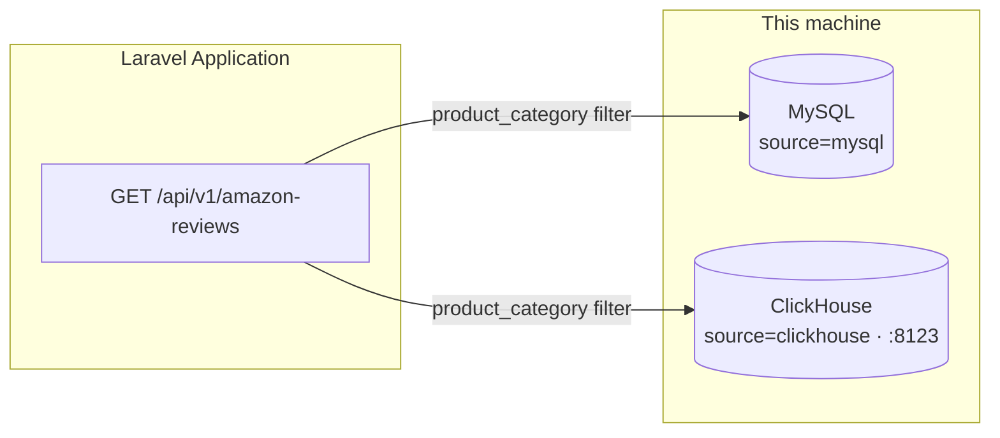

# ClickHouse Analytics for Laravel

Laravel application that uses **ClickHouse** as a dedicated analytics store alongside a traditional OLTP database (MySQL, SQLite, etc.). Application data stays on your default connection; event and analytics workloads go through a separate `clickhouse` connection over HTTPS.


## Table of contents

- [Features](#features)
- [Architecture](#architecture)
- [Requirements](#requirements)
- [Installation](#installation)
- [Run local ClickHouse](#run-local-clickhouse)
- [Configuration](#configuration)
- [Database setup](#database-setup)
- [API](#api)
- [Compare with Telescope](#compare-with-telescope)
- [Inspect ClickHouse tables](#inspect-clickhouse-tables)
- [Project structure](#project-structure)
- [Documentation](#documentation)

## Features

- ClickHouse via HTTP (local `:8123` or Cloud HTTPS `:8443`)
- Same `amazon_reviews` dataset on ClickHouse **and** MySQL
- Single list API with `source=clickhouse|mysql`
- Seed large sample data from public S3 Parquet
- Sync ClickHouse → MySQL for fair local benchmarks
- Laravel Telescope for request duration inspection

## Architecture



| Store | Connection / model | Role |
|-------|--------------------|------|
| MySQL | `mysql` · `App\Models\Mysql\AmazonReview` | App DB + mirrored reviews for comparison |
| ClickHouse | `clickhouse` · `App\Models\AmazonReview` | Analytics store |

## Requirements

| Dependency | Version |
|------------|---------|
| PHP | 8.3+ |
| Laravel | 13 |
| Composer | 2.x |
| MySQL | Local instance |
| ClickHouse | Local binary and/or [ClickHouse Cloud](https://clickhouse.cloud/) |
| Package | [`laravel-clickhouse/laravel-clickhouse`](https://github.com/laravel-clickhouse/laravel-clickhouse) ^1.4 |

## Installation

```bash
git clone <repository-url>
cd clickhouse

composer install
cp .env.example .env
php artisan key:generate

php artisan migrate --database=mysql
```

## Run local ClickHouse

Install (macOS example):

```bash
curl https://clickhouse.com/ | sh
```

Start the server:

```bash
mkdir -p ~/clickhouse-data
cd ~/clickhouse-data
~/clickhouse server -- --path=$HOME/clickhouse-data
```

Verify:

```bash
curl 'http://127.0.0.1:8123/?query=SELECT%201'
# → 1
```

## Configuration

### Local ClickHouse

```env
DB_CONNECTION=mysql
DB_HOST=127.0.0.1
DB_PORT=3306
DB_DATABASE=click_house
DB_USERNAME=root
DB_PASSWORD=

MYSQL_DATABASE=click_house

CLICKHOUSE_HOST=127.0.0.1
CLICKHOUSE_PORT=8123
CLICKHOUSE_DATABASE=default
CLICKHOUSE_USERNAME=default
CLICKHOUSE_PASSWORD=
CLICKHOUSE_HTTPS=false
CLICKHOUSE_TRANSPORT=guzzle
CLICKHOUSE_TIMEOUT=30
CLICKHOUSE_CONNECT_TIMEOUT=10

TELESCOPE_ENABLED=true
TELESCOPE_DB_CONNECTION=mysql
```

### ClickHouse Cloud

```env
CLICKHOUSE_HOST=your-service.region.provider.clickhouse.cloud
CLICKHOUSE_PORT=8443
CLICKHOUSE_USERNAME=default
CLICKHOUSE_PASSWORD=your-password
CLICKHOUSE_HTTPS=true
```

| Setting | Local | Cloud |
|---------|-------|-------|
| Host | `127.0.0.1` | `*.clickhouse.cloud` |
| Port | `8123` | `8443` |
| HTTPS | `false` | `true` |

> Use the **HTTPS** credentials for Cloud — not the MySQL wire-protocol username/port.

After changing `.env`:

```bash
php artisan config:clear
```

## Database setup

### 1. Create ClickHouse table

```bash
php artisan migrate --database=clickhouse \
  --path=database/migrations/2026_09_24_091808_create_amazon_reviews_table.php
```

### 2. Seed sample reviews from S3

```bash
# Default: 100,000 rows
php artisan db:seed --class=AmazonReviewSeeder --database=clickhouse

# Custom size
AMAZON_REVIEWS_SEED_LIMIT=500000 php artisan db:seed --class=AmazonReviewSeeder --database=clickhouse
```

### 3. Create MySQL mirror + sync

```bash
php artisan migrate --database=mysql \
  --path=database/migrations/2026_09_24_093646_create_mysql_amazon_reviews_table.php

php artisan amazon-reviews:sync-mysql --truncate
```

## API

Only one endpoint is exposed:

| Method | Path | Description |
|--------|------|-------------|
| `GET` | `/api/v1/amazon-reviews` | Return matching Amazon reviews |

### Query parameters

| Param | Values | Description |
|-------|--------|-------------|
| `source` | `clickhouse` (default) · `mysql` | Which database to read |
| `product_category` | e.g. `Grocery` | Optional filter |
| `all` | `1` | Accepted for compatibility (response is always the full matching set) |

### Examples

```bash
php artisan serve
```

```bash
# ClickHouse
curl "http://localhost:8000/api/v1/amazon-reviews?all=1&product_category=Grocery&source=clickhouse"

# MySQL
curl "http://localhost:8000/api/v1/amazon-reviews?all=1&product_category=Grocery&source=mysql"
```

## Compare with Telescope

```bash
composer require laravel/telescope --dev
php artisan telescope:install
php artisan migrate --database=mysql
```

1. Start the app: `php artisan serve`
2. Open **http://localhost:8000/telescope**
3. Hit both curl commands above
4. In **Requests**, compare **Duration** for each call

**Duration** = full Laravel request time (DB query + model hydration + JSON), not engine-only time.


## Inspect ClickHouse tables

```bash
~/clickhouse client
```

```sql
SHOW TABLES;
SELECT count() FROM amazon_reviews;
SELECT * FROM amazon_reviews WHERE product_category = 'Grocery' LIMIT 10;
```

Or via HTTP:

```bash
curl 'http://127.0.0.1:8123/?query=SHOW%20TABLES'
```

Partitions / parts:

```sql
SELECT partition, name, rows
FROM system.parts
WHERE table = 'amazon_reviews' AND active
ORDER BY partition;
```

## Project structure

| Path | Purpose |
|------|---------|
| `config/database.php` | `clickhouse` + `mysql` connections |
| `app/Models/AmazonReview.php` | ClickHouse Eloquent model |
| `app/Models/Mysql/AmazonReview.php` | MySQL Eloquent model |
| `app/Http/Controllers/Api/V1/AmazonReviewController.php` | List API |
| `database/migrations/2026_09_24_091808_create_amazon_reviews_table.php` | ClickHouse `MergeTree` table |
| `database/migrations/2026_09_24_093646_create_mysql_amazon_reviews_table.php` | MySQL mirror table |
| `database/seeders/AmazonReviewSeeder.php` | Load Parquet from S3 into ClickHouse |
| `app/Console/Commands/SyncAmazonReviewsToMysqlCommand.php` | Sync CH → MySQL |

## Documentation

- [laravel-clickhouse](https://github.com/laravel-clickhouse/laravel-clickhouse)
- [Amazon reviews dataset](https://clickhouse.com/docs/getting-started/example-datasets/amazon-reviews)
- [Laravel Telescope](https://laravel.com/docs/telescope)
- [ClickHouse docs](https://clickhouse.com/docs)
